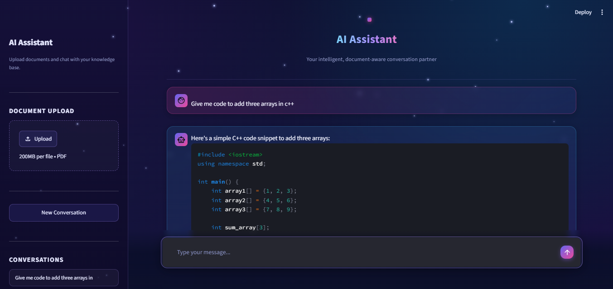

# LangGraph AI Chatbot 🤖

A simple AI chatbot built using LangGraph, Groq LLM, Streamlit, and RAG.

The chatbot supports:
- AI conversations
- Web search
- Calculator
- Stock price lookup
- PDF document question answering (RAG)
- Chat history storage


## Features

- LangGraph workflow
- Groq Llama model
- Tool calling
- PDF RAG system
- FAISS vector search
- Streamlit user interface
- SQLite chat memory


## Tech Stack

- Python
- LangGraph
- LangChain
- Groq API
- Streamlit
- FAISS
- Google Gemini Embeddings
- SQLite


## Project Structure

```
LangGraph-AI-Chatbot/

│
├── Backend/
│   └── server.py
│
├── Frontend/
│   └── app.py
│
├── requirements.txt
├── .gitignore
└── README.md
```


## Installation

Clone repository:

```bash
git clone https://github.com/your-username/LangGraph-AI-Chatbot.git
```

Go inside project:

```bash
cd LangGraph-AI-Chatbot
```


Create virtual environment:

```bash
python -m venv venv
```


Activate environment:

Windows:

```bash
venv\Scripts\activate
```


Install dependencies:

```bash
pip install -r requirements.txt
```


## Environment Variables

Create a `.env` file:

```
GROQ_API_KEY=your_api_key
GOOGLE_API_KEY=your_api_key
```


## Run Application

Start Streamlit:

```bash
streamlit run Frontend/app.py
```


## Screenshot



## Future Improvements

- PostgreSQL database
- User authentication
- Better document management
- Cloud deployment


## Author

Muhammad Talha
